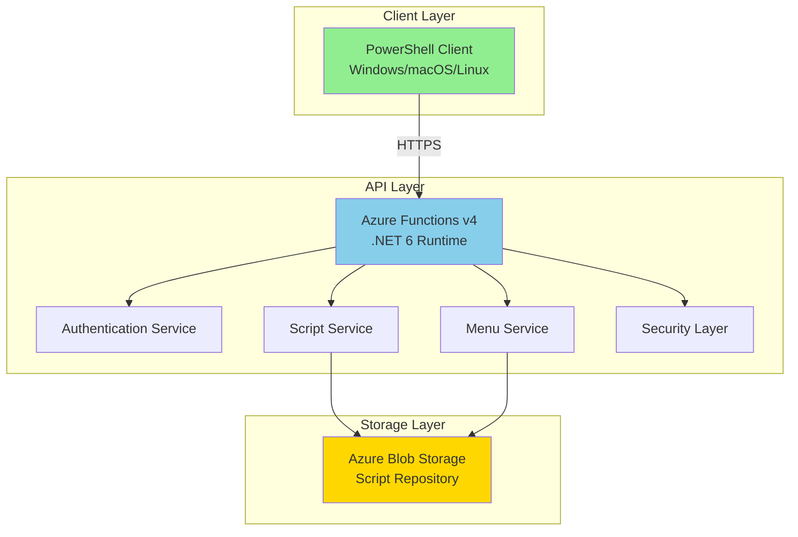

# 🚀 InvokeHub - Enterprise PowerShell Script Management Platform

[](https://azure.microsoft.com/services/functions/)
[](https://dotnet.microsoft.com/)
[](https://microsoft.com/powershell)
[](https://opensource.org/licenses/MIT)
[](http://makeapullrequest.com)

> A secure, cloud-based PowerShell script repository with an interactive cross-platform client. Store, organize, and execute your PowerShell scripts from anywhere with enterprise-grade security.

## 📋 Table of Contents

- [Features](#-features)
- [Demo](#-demo)
- [Architecture](#-architecture)
- [Prerequisites](#-prerequisites)
- [Quick Start](#-quick-start)
- [Installation](#-installation)
- [Configuration](#-configuration)
- [Usage](#-usage)
- [API Documentation](#-api-documentation)
- [PowerShell Client](#-powershell-client)
- [Security](#-security)
- [Deployment](#-deployment)
- [Development](#-development)
- [Troubleshooting](#-troubleshooting)
- [Contributing](#-contributing)
- [License](#-license)

## ✨ Features

### Core Features
- 📁 **Hierarchical Script Organization** - Organize scripts in nested folder structures
- 🔒 **Multiple Authentication Methods** - API Key or Password-based authentication
- 🛡️ **Enterprise Security** - Comprehensive security with path validation, script scanning, and rate limiting
- 🌐 **Cross-Platform Client** - Native PowerShell client works on Windows, macOS, and Linux
- ⚡ **One-Line Installation** - Deploy and run with a single command
- 🔍 **Advanced Search** - Find scripts quickly with wildcard support and metadata search
- 📊 **Script Metadata** - Add descriptions, authors, and custom metadata to scripts
- 🚦 **Health Monitoring** - Built-in health check endpoint for monitoring
- 💾 **Multiple Storage Options** - Azure Blob Storage with container isolation
- 🔄 **Version Information** - Track script versions and modifications

### Security Features
- **Path Traversal Protection** - Validates all file paths against injection attacks
- **Script Content Validation** - Blocks potentially dangerous PowerShell commands
- **Rate Limiting** - Protects against DDoS and brute force attacks
- **Security Headers** - Implements CSP, X-Frame-Options, X-Content-Type-Options
- **Timing-Safe Authentication** - Prevents timing attacks on authentication
- **Session Tokens** - Secure session management with expiration
- **HTTPS Only** - Enforces encrypted connections
- **Input Sanitization** - Sanitizes all user inputs

### Client Features
- **Interactive Menu System** - Navigate scripts with an intuitive menu
- **Script Preview** - View script content before execution
- **Safe Execution** - Scripts run in isolated scope with confirmation
- **Download Options** - Save scripts locally or copy to clipboard
- **Syntax Highlighting** - Color-coded script display
- **Pagination** - Handle large script repositories efficiently
- **Error Recovery** - Graceful error handling with retry logic
- **Debug Mode** - Verbose logging for troubleshooting

## 🎬 Demo

```powershell
# One-line installation and launch
irm https://your-invokehub-api.azurewebsites.net/api/loader | iex

# Or with API key
irm "https://your-invokehub-api.azurewebsites.net/api/loader?key=YOUR-KEY" | iex
```

### Screenshots

<details>
<summary>📸 View Screenshots</summary>

#### Main Menu
```
  InvokeHub v1.0
  ===============
  Script Management Platform

  Repository: 42 Scripts

  📁 Administration
    [1] Update-ADUsers.ps1 (12.3 KB)
    [2] Reset-Passwords.ps1 (8.7 KB)

  📁 Deployment
    [3] Deploy-WebApp.ps1 (45.2 KB)
    [4] Configure-IIS.ps1 (23.1 KB)

  [S] Suchen | [F] Filter | [H] Hilfe | [Q] Beenden

  Auswahl: _
```

#### Script Actions
```
  Deploy-WebApp.ps1
  =================

  Pfad: Deployment/Deploy-WebApp.ps1
  Größe: 45.2 KB
  Geändert: 2024-01-15 14:32:00
  Metadaten:
    author: DevOps Team
    description: Automated web application deployment

  [1] Ausführen
  [2] Herunterladen
  [3] Inhalt anzeigen
  [4] In Zwischenablage kopieren
  [0] Zurück

  Aktion: _
```

</details>

## 🏗️ Architecture

### System Overview



### Component Architecture

```
InvokeHub/
├── Api/                        # HTTP Endpoints
│   └── InvokeHubApi.cs        # RESTful API implementation
├── Services/                   # Business Logic
│   ├── AuthenticationService.cs # Authentication handling
│   ├── MenuService.cs         # Menu structure generation
│   └── ScriptService.cs       # Script management
├── Security/                   # Security Components
│   ├── PathValidator.cs       # Path traversal protection
│   ├── RateLimiter.cs        # Rate limiting implementation
│   └── ScriptValidator.cs     # Script content validation
├── Models/                     # Data Models
│   └── MenuStructure.cs       # Menu data structure
├── Utilities/                  # Helper Classes
│   ├── HashingUtilities.cs    # Cryptographic operations
│   ├── ResourceHelper.cs      # Embedded resource management
│   └── SecurityHeaders.cs     # HTTP security headers
├── Scripts/                    # Embedded Scripts
│   └── Client.ps1             # PowerShell client
├── Configuration.cs           # Central configuration
├── Startup.cs                 # Dependency injection setup
└── InvokeHub.csproj          # Project configuration
```

## 📋 Prerequisites

### For Development
- [.NET SDK 6.0+](https://dotnet.microsoft.com/download/dotnet/6.0)
- [Azure Functions Core Tools v4](https://docs.microsoft.com/azure/azure-functions/functions-run-local)
- [PowerShell 5.1+](https://docs.microsoft.com/powershell/scripting/install/installing-powershell)
- [Visual Studio 2022](https://visualstudio.microsoft.com/) or [VS Code](https://code.visualstudio.com/)
- [Git](https://git-scm.com/)

### For Production
- [Azure Subscription](https://azure.microsoft.com/free/)
- [Azure Storage Account](https://docs.microsoft.com/azure/storage/common/storage-account-overview)
- [Azure Functions](https://azure.microsoft.com/services/functions/)

### Optional Tools
- [Azure CLI](https://docs.microsoft.com/cli/azure/install-azure-cli)
- [Azurite](https://github.com/Azure/Azurite) (Local storage emulator)
- [Azure Storage Explorer](https://azure.microsoft.com/features/storage-explorer/)

## 🚀 Quick Start

### 1. Clone and Setup

```bash
# Clone the repository
git clone https://github.com/yourusername/invokehub.git
cd invokehub

# Run the setup script (Windows PowerShell)
./setup-dev.ps1

# Or manually
cp local.settings.json.template local.settings.json
dotnet restore
```

### 2. Configure Local Settings

Edit `local.settings.json`:

```json
{
  "IsEncrypted": false,
  "Values": {
    "AzureWebJobsStorage": "UseDevelopmentStorage=true",
    "FUNCTIONS_WORKER_RUNTIME": "dotnet",
    "API_KEY": "your-dev-api-key",
    "BlobContainerName": "powershell-scripts"
  }
}
```

### 3. Start Local Development

```bash
# Start Azurite (optional, for local storage)
azurite --silent --location ./.azurite

# Start the function app
func start

# In another terminal, test the API
curl http://localhost:7071/api/health
```

### 4. Test the Client

```powershell
# Download and test the client locally
irm http://localhost:7071/api/loader | iex
```

## 🔧 Installation

### Option 1: Local Development Setup

<details>
<summary>📖 Detailed Local Setup</summary>

1. **Install Prerequisites**
   ```bash
   # Install .NET 6 SDK
   # Windows: Download from https://dotnet.microsoft.com
   # macOS: brew install dotnet-sdk
   # Linux: Follow distribution-specific instructions

   # Install Azure Functions Core Tools
   npm install -g azure-functions-core-tools@4

   # Install Azurite (optional)
   npm install -g azurite
   ```

2. **Clone Repository**
   ```bash
   git clone https://github.com/yourusername/invokehub.git
   cd invokehub
   ```

3. **Setup Development Environment**
   ```powershell
   # Run automated setup
   ./setup-dev.ps1

   # Or manual setup
   cp local.settings.json.template local.settings.json
   # Edit local.settings.json with your values
   
   dotnet restore
   dotnet build
   ```

4. **Prepare Storage**
   ```bash
   # Option A: Use Azurite (local emulator)
   azurite --silent --location ./.azurite

   # Option B: Use real Azure Storage
   # Update AzureWebJobsStorage in local.settings.json
   ```

5. **Upload Sample Scripts**
   ```powershell
   # Create container and upload scripts
   # Use Azure Storage Explorer or Azure CLI
   az storage container create -n powershell-scripts
   az storage blob upload -f ./samples/Hello-World.ps1 -c powershell-scripts -n samples/Hello-World.ps1
   ```

</details>

### Option 2: Docker Setup

<details>
<summary>🐳 Docker Deployment</summary>

```dockerfile
# Dockerfile
FROM mcr.microsoft.com/azure-functions/dotnet:4

WORKDIR /home/site/wwwroot
COPY ./publish .

ENV AzureWebJobsScriptRoot=/home/site/wwwroot \
    AzureFunctionsJobHost__Logging__Console__IsEnabled=true
```

```bash
# Build and run
docker build -t invokehub .
docker run -p 8080:80 -e API_KEY=your-key invokehub
```

</details>

## ⚙️ Configuration

### Environment Variables

| Variable | Description | Default | Required |
|----------|-------------|---------|----------|
| **Storage** |
| `AzureWebJobsStorage` | Azure Storage connection string | - | ✅ Yes |
| `BlobContainerName` | Container name for scripts | `powershell-scripts` | No |
| **Authentication** |
| `API_KEY` | API key for authentication | - | ⚠️ One required |
| `API_PASSWORD` | Alternative password authentication | - | ⚠️ One required |
| **Security** |
| `REQUIRE_SIGNED_SCRIPTS` | Require PowerShell script signing | `false` | No |
| `MAX_SCRIPT_SIZE_KB` | Maximum script size in KB | `1024` | No |
| `RATE_LIMIT_SECONDS` | Rate limit window in seconds | `1` | No |
| **Caching** |
| `CACHE_CONTROL_SECONDS` | Cache control header duration | `300` | No |
| **API URLs** |
| `API_BASE_URL` | Base URL for local development | `http://localhost:7071/api` | No |
| `PRODUCTION_API_URL` | Production API URL | - | No |

### Storage Configuration

<details>
<summary>📁 Blob Storage Structure</summary>

```
powershell-scripts/           # Container
├── Administration/           # Folder
│   ├── Update-ADUsers.ps1
│   └── Reset-Passwords.ps1
├── Deployment/              # Folder
│   ├── Deploy-WebApp.ps1
│   └── Configure-IIS.ps1
└── Utilities/               # Folder
    ├── Get-SystemInfo.ps1
    └── Clear-TempFiles.ps1
```

**Naming Conventions:**
- Scripts must end with `.ps1`
- Use folders for organization
- Avoid special characters except `-` and `_`
- Case-insensitive but preserve case

</details>

### Security Configuration

<details>
<summary>🔒 Security Settings</summary>

```json
{
  "Values": {
    // Authentication
    "API_KEY": "generate-strong-key-here",
    
    // Script Security
    "REQUIRE_SIGNED_SCRIPTS": "true",
    "MAX_SCRIPT_SIZE_KB": "500",
    
    // Rate Limiting
    "RATE_LIMIT_SECONDS": "2",
    
    // Additional Security
    "ALLOWED_IP_RANGES": "10.0.0.0/8,172.16.0.0/12",
    "ENABLE_AUDIT_LOG": "true"
  }
}
```

</details>

## 📖 Usage

### For End Users

#### Basic Usage

```powershell
# Method 1: One-line execution
irm https://your-api.azurewebsites.net/api/loader | iex

# Method 2: Download and run
Invoke-RestMethod https://your-api.azurewebsites.net/api/client -OutFile InvokeHub.ps1
. ./InvokeHub.ps1
Start-InvokeHub -ApiUrl "https://your-api.azurewebsites.net/api"
```

#### With Authentication

```powershell
# API Key authentication
irm "https://your-api.azurewebsites.net/api/loader?key=YOUR-API-KEY" | iex

# Password authentication
irm https://your-api.azurewebsites.net/api/loader | iex
# You'll be prompted for password

# Direct client with parameters
Start-InvokeHub -ApiUrl "https://your-api.azurewebsites.net/api" -ApiKey "YOUR-KEY"
Start-InvokeHub -ApiUrl "https://your-api.azurewebsites.net/api" -UsePassword
```

#### Advanced Usage

```powershell
# Enable debug mode
Start-InvokeHub -ApiUrl $url -ApiKey $key -EnableDebug

# Custom timeout
Start-InvokeHub -ApiUrl $url -ApiKey $key -TimeoutSeconds 60

# Use in scripts
$apiUrl = "https://your-api.azurewebsites.net/api"
$apiKey = $env:INVOKEHUB_API_KEY
. (irm "$apiUrl/client")
Start-InvokeHub -ApiUrl $apiUrl -ApiKey $apiKey
```

### Client Commands

| Command | Description | Example |
|---------|-------------|---------|
| **Navigation** |
| Number | Select script by number | `5` |
| S | Search scripts | `S` → `*deploy*` |
| F | Filter by folder | `F` → Select folder |
| H | Show help | `H` |
| Q | Quit | `Q` |
| **Script Actions** |
| 1 | Execute script | Runs with confirmation |
| 2 | Download script | Saves to desktop |
| 3 | View content | Shows with syntax highlighting |
| 4 | Copy to clipboard | Windows only |
| 0 | Back to menu | Returns to main menu |

## 📡 API Documentation

### Base URL
```
https://your-invokehub-api.azurewebsites.net/api
```

### Authentication
All endpoints except `/health` and `/loader` require authentication via `X-API-Key` header.

### Endpoints

#### 🔐 POST /auth
Authenticate user and receive session token.

**Request:**
```http
POST /api/auth
X-API-Key: your-api-key
```

**Response:**
```json
{
  "authenticated": true,
  "sessionToken": "...",
  "expiresIn": 3600,
  "authMode": "apikey"
}
```

#### 📋 GET /menu
Get the complete script repository structure.

**Request:**
```http
GET /api/menu
X-API-Key: your-api-key
```

**Response:**
```json
{
  "name": "Root",
  "type": "folder",
  "path": "",
  "children": [
    {
      "name": "Deploy-WebApp.ps1",
      "type": "script",
      "path": "Deployment/Deploy-WebApp.ps1",
      "size": 45312,
      "lastModified": "2024-01-15T14:32:00Z",
      "metadata": {
        "author": "DevOps Team",
        "description": "Automated deployment"
      }
    }
  ]
}
```

#### 📄 GET /script
Download a specific script.

**Request:**
```http
GET /api/script?path=Deployment/Deploy-WebApp.ps1
X-API-Key: your-api-key
```

**Response:**
```json
{
  "path": "Deployment/Deploy-WebApp.ps1",
  "content": "# PowerShell script content...",
  "lastModified": "2024-01-15T14:32:00Z",
  "contentHash": "SHA256Hash...",
  "metadata": {}
}
```

#### 🚀 GET /loader
Get the PowerShell loader script.

**Request:**
```http
GET /api/loader?key=optional-api-key
```

**Response:**
```powershell
# InvokeHub Loader v1.0.0
# ... loader script content ...
```

#### 💻 GET /client
Get the complete PowerShell client.

**Request:**
```http
GET /api/client
```

**Response:**
```powershell
# InvokeHub Client v1.0.0
# ... client script content ...
```

#### 🏥 GET /health
Health check endpoint for monitoring.

**Request:**
```http
GET /api/health
```

**Response:**
```json
{
  "status": "healthy",
  "timestamp": "2024-01-15T10:30:00Z",
  "version": "1.0.0",
  "platform": "InvokeHub",
  "authMode": "apikey",
  "containerName": "powershell-scripts",
  "environment": "Production"
}
```

### Error Responses

| Status Code | Description | Example |
|-------------|-------------|---------|
| 400 | Bad Request | Invalid script path |
| 401 | Unauthorized | Missing or invalid API key |
| 404 | Not Found | Script not found |
| 429 | Too Many Requests | Rate limit exceeded |
| 500 | Internal Server Error | Server error |

**Error Response Format:**
```json
{
  "error": "Error message description"
}
```

## 🖥️ PowerShell Client

### Client Architecture

```
Start-InvokeHub
├── Authentication
│   ├── API Key validation
│   └── Password authentication
├── Menu System
│   ├── Load repository structure
│   ├── Display scripts by folder
│   └── Pagination support
├── Search & Filter
│   ├── Wildcard search
│   ├── Metadata search
│   └── Folder filtering
└── Script Actions
    ├── Safe execution
    ├── Download
    ├── Preview
    └── Clipboard
```

### Client Features

<details>
<summary>🎯 Feature Details</summary>

#### Smart Authentication
- Detects authentication mode from API
- Secure password input
- Session token management
- Automatic retry on failure

#### Interactive Menu
- Hierarchical folder display
- Script size information
- Metadata display
- Pagination for large repositories

#### Search Capabilities
- Wildcard support (`*deploy*`)
- Search in names and paths
- Metadata search (author, description)
- Case-insensitive matching

#### Safe Script Execution
- Confirmation prompt
- Hash verification display
- Isolated execution scope
- Error handling

#### Platform Support
- Windows PowerShell 5.1+
- PowerShell Core 7+ (Windows/macOS/Linux)
- Automatic TLS 1.2 enablement
- Cross-platform clipboard support

</details>

### Customization

```powershell
# Custom client wrapper
function Start-MyInvokeHub {
    $apiUrl = "https://mycompany-invokehub.azurewebsites.net/api"
    $apiKey = $env:INVOKEHUB_API_KEY
    
    if (-not $apiKey) {
        $apiKey = Read-Host "Enter API Key" -AsSecureString
        $apiKey = [Runtime.InteropServices.Marshal]::PtrToStringAuto(
            [Runtime.InteropServices.Marshal]::SecureStringToBSTR($apiKey)
        )
    }
    
    . (irm "$apiUrl/client")
    Start-InvokeHub -ApiUrl $apiUrl -ApiKey $apiKey -EnableDebug
}
```

## 🔒 Security

### Security Features

#### 1. Authentication & Authorization
- **API Key Authentication**: Strong key validation
- **Password Authentication**: Alternative method
- **Session Tokens**: Temporary tokens with expiration
- **Timing-Safe Comparison**: Prevents timing attacks

#### 2. Input Validation
- **Path Validation**: Prevents directory traversal
  ```csharp
  // Blocked patterns:
  // "..", "\\", "://", absolute paths
  ```
- **Script Validation**: Blocks dangerous commands
  ```csharp
  // Blocked: rm -rf /, format c:, etc.
  ```

#### 3. Rate Limiting
- Per-IP rate limiting
- Configurable time windows
- Automatic cleanup of old entries

#### 4. Security Headers
```
X-Content-Type-Options: nosniff
X-Frame-Options: DENY
X-XSS-Protection: 1; mode=block
Referrer-Policy: strict-origin-when-cross-origin
Content-Security-Policy: default-src 'self'
Permissions-Policy: geolocation=(), microphone=(), camera=()
```

#### 5. Script Security
- Maximum file size limits
- Optional script signing requirement
- Content hash verification
- Dangerous command detection

### Security Best Practices

<details>
<summary>🛡️ Implementation Guidelines</summary>

1. **API Key Management**
   - Use strong, random API keys (min 32 chars)
   - Rotate keys regularly
   - Never commit keys to source control
   - Use Azure Key Vault for production

2. **Network Security**
   - Always use HTTPS
   - Configure IP restrictions if needed
   - Use Azure Private Endpoints for storage
   - Enable Azure DDoS Protection

3. **Script Repository**
   - Regular security audits
   - Version control for scripts
   - Access logging
   - Backup strategy

4. **Monitoring**
   - Enable Application Insights
   - Configure alerts for failures
   - Monitor rate limit violations
   - Track authentication failures

</details>

## 🚀 Deployment

### Azure Deployment Guide

<details>
<summary>☁️ Complete Azure Deployment</summary>

#### 1. Prerequisites
```bash
# Install Azure CLI
# Windows: Download installer
# macOS: brew install azure-cli
# Linux: curl -sL https://aka.ms/InstallAzureCLIDeb | sudo bash

# Login to Azure
az login
```

#### 2. Create Resources

```bash
# Variables
$resourceGroup = "rg-invokehub-prod"
$location = "westeurope"
$storageAccount = "stinvokehub$(Get-Random -Maximum 9999)"
$functionApp = ""
$appInsights = "ai-invokehub-prod"

# Create resource group
az group create `
  --name $resourceGroup `
  --location $location

# Create storage account
az storage account create `
  --name $storageAccount `
  --resource-group $resourceGroup `
  --location $location `
  --sku Standard_LRS `
  --kind StorageV2

# Get storage connection string
$storageConnection = az storage account show-connection-string `
  --name $storageAccount `
  --resource-group $resourceGroup `
  --query connectionString `
  --output tsv

# Create container
az storage container create `
  --name "powershell-scripts" `
  --connection-string $storageConnection

# Create Application Insights
az monitor app-insights component create `
  --app $appInsights `
  --resource-group $resourceGroup `
  --location $location

# Get Instrumentation Key
$instrumentationKey = az monitor app-insights component show `
  --app $appInsights `
  --resource-group $resourceGroup `
  --query instrumentationKey `
  --output tsv

# Create Function App
az functionapp create `
  --name $functionApp `
  --resource-group $resourceGroup `
  --storage-account $storageAccount `
  --consumption-plan-location $location `
  --runtime dotnet `
  --runtime-version 6 `
  --functions-version 4 `
  --app-insights-key $instrumentationKey
```

#### 3. Configure Settings

```bash
# Generate secure API key
$apiKey = [System.Web.Security.Membership]::GeneratePassword(32, 8)

# Configure app settings
az functionapp config appsettings set `
  --name $functionApp `
  --resource-group $resourceGroup `
  --settings `
    "API_KEY=$apiKey" `
    "BlobContainerName=powershell-scripts" `
    "PRODUCTION_API_URL=https://$functionApp.azurewebsites.net/api" `
    "REQUIRE_SIGNED_SCRIPTS=false" `
    "MAX_SCRIPT_SIZE_KB=1024" `
    "RATE_LIMIT_SECONDS=1" `
    "APPINSIGHTS_INSTRUMENTATIONKEY=$instrumentationKey"

# Save API key securely
Write-Host "API Key: $apiKey" -ForegroundColor Yellow
Write-Host "Save this key securely - it won't be shown again!" -ForegroundColor Red
```

#### 4. Deploy Code

```bash
# Build and publish
dotnet publish -c Release -o ./publish

# Create deployment package
Compress-Archive -Path ./publish/* -DestinationPath deploy.zip -Force

# Deploy to Azure
az functionapp deployment source config-zip `
  --resource-group $resourceGroup `
  --name $functionApp `
  --src ./deploy.zip

# Verify deployment
$healthUrl = "https://$functionApp.azurewebsites.net/api/health"
Invoke-RestMethod $healthUrl
```

#### 5. Upload Scripts

```bash
# Upload sample scripts
az storage blob upload-batch `
  --destination "powershell-scripts" `
  --source "./sample-scripts" `
  --connection-string $storageConnection `
  --pattern "*.ps1"
```

#### 6. Test Deployment

```powershell
# Test the loader
$loaderUrl = "https://$functionApp.azurewebsites.net/api/loader?key=$apiKey"
irm $loaderUrl | iex
```

</details>

### CI/CD with GitHub Actions

<details>
<summary>🔄 Automated Deployment</summary>

Create `.github/workflows/deploy.yml`:

```yaml
name: Deploy InvokeHub

on:
  push:
    branches: [ main ]
  pull_request:
    branches: [ main ]

env:
  AZURE_FUNCTIONAPP_NAME: 
  AZURE_FUNCTIONAPP_PACKAGE_PATH: '.'
  DOTNET_VERSION: '6.0.x'

jobs:
  build-and-deploy:
    runs-on: ubuntu-latest
    steps:
    - name: Checkout
      uses: actions/checkout@v3

    - name: Setup .NET
      uses: actions/setup-dotnet@v3
      with:
        dotnet-version: ${{ env.DOTNET_VERSION }}

    - name: Restore
      run: dotnet restore

    - name: Build
      run: dotnet build --configuration Release

    - name: Test
      run: dotnet test --no-build --configuration Release

    - name: Publish
      run: dotnet publish --configuration Release --output ./publish

    - name: Deploy to Azure Functions
      uses: Azure/functions-action@v1
      with:
        app-name: ${{ env.AZURE_FUNCTIONAPP_NAME }}
        package: './publish'
        publish-profile: ${{ secrets.AZURE_FUNCTIONAPP_PUBLISH_PROFILE }}

    - name: Verify Deployment
      run: |
        sleep 30
        curl -f https://${{ env.AZURE_FUNCTIONAPP_NAME }}.azurewebsites.net/api/health
```

**Setup GitHub Secrets:**
1. Get publish profile:
   ```bash
   az functionapp deployment list-publishing-profiles `
     --name  `
     --resource-group rg-invokehub-prod `
     --xml
   ```
2. Add to GitHub: Settings → Secrets → New repository secret
3. Name: `AZURE_FUNCTIONAPP_PUBLISH_PROFILE`

</details>

### Infrastructure as Code

<details>
<summary>🏗️ Bicep Template</summary>

Create `infrastructure/main.bicep`:

```bicep
param location string = resourceGroup().location
param functionAppName string = 'invokehub-api-${uniqueString(resourceGroup().id)}'
param storageAccountName string = 'stinvokehub${uniqueString(resourceGroup().id)}'
param apiKey string = newGuid()

// Storage Account
resource storageAccount 'Microsoft.Storage/storageAccounts@2021-09-01' = {
  name: storageAccountName
  location: location
  sku: {
    name: 'Standard_LRS'
  }
  kind: 'StorageV2'
}

// Blob Container
resource blobService 'Microsoft.Storage/storageAccounts/blobServices@2021-09-01' = {
  parent: storageAccount
  name: 'default'
}

resource container 'Microsoft.Storage/storageAccounts/blobServices/containers@2021-09-01' = {
  parent: blobService
  name: 'powershell-scripts'
  properties: {
    publicAccess: 'None'
  }
}

// App Service Plan
resource appServicePlan 'Microsoft.Web/serverfarms@2021-03-01' = {
  name: '${functionAppName}-plan'
  location: location
  sku: {
    name: 'Y1'
    tier: 'Dynamic'
  }
}

// Application Insights
resource appInsights 'Microsoft.Insights/components@2020-02-02' = {
  name: '${functionAppName}-insights'
  location: location
  kind: 'web'
  properties: {
    Application_Type: 'web'
  }
}

// Function App
resource functionApp 'Microsoft.Web/sites@2021-03-01' = {
  name: functionAppName
  location: location
  kind: 'functionapp'
  properties: {
    serverFarmId: appServicePlan.id
    siteConfig: {
      appSettings: [
        {
          name: 'AzureWebJobsStorage'
          value: 'DefaultEndpointsProtocol=https;AccountName=${storageAccount.name};EndpointSuffix=${environment().suffixes.storage};AccountKey=${storageAccount.listKeys().keys[0].value}'
        }
        {
          name: 'FUNCTIONS_EXTENSION_VERSION'
          value: '~4'
        }
        {
          name: 'FUNCTIONS_WORKER_RUNTIME'
          value: 'dotnet'
        }
        {
          name: 'APPINSIGHTS_INSTRUMENTATIONKEY'
          value: appInsights.properties.InstrumentationKey
        }
        {
          name: 'API_KEY'
          value: apiKey
        }
        {
          name: 'BlobContainerName'
          value: 'powershell-scripts'
        }
        {
          name: 'PRODUCTION_API_URL'
          value: 'https://${functionAppName}.azurewebsites.net/api'
        }
      ]
    }
  }
}

output functionAppName string = functionApp.name
output functionAppUrl string = 'https://${functionApp.properties.defaultHostName}'
output apiKey string = apiKey
```

Deploy with:
```bash
az deployment group create `
  --resource-group rg-invokehub-prod `
  --template-file infrastructure/main.bicep
```

</details>

## 👨‍💻 Development

### Development Workflow

1. **Branch Strategy**
   ```
   main
   ├── develop
   │   ├── feature/add-search
   │   ├── feature/improve-security
   │   └── bugfix/rate-limit-issue
   └── release/v1.1.0
   ```

2. **Code Style**
   - Follow [C# Coding Conventions](https://docs.microsoft.com/en-us/dotnet/csharp/fundamentals/coding-style/coding-conventions)
   - Use meaningful names
   - Add XML documentation
   - Write unit tests

3. **Testing**
   ```bash
   # Run all tests
   dotnet test

   # With coverage
   dotnet test /p:CollectCoverage=true

   # Integration tests
   dotnet test --filter Category=Integration
   ```

### Project Structure

<details>
<summary>📁 Detailed Structure</summary>

```
InvokeHub/
├── .github/
│   └── workflows/
│       └── deploy.yml              # CI/CD pipeline
├── Api/
│   └── InvokeHubApi.cs            # HTTP endpoints
├── Services/
│   ├── AuthenticationService.cs    # Auth logic
│   ├── MenuService.cs             # Menu generation
│   └── ScriptService.cs           # Script management
├── Security/
│   ├── PathValidator.cs           # Path security
│   ├── RateLimiter.cs            # Rate limiting
│   └── ScriptValidator.cs         # Script validation
├── Models/
│   └── MenuStructure.cs           # Data models
├── Utilities/
│   ├── HashingUtilities.cs        # Crypto helpers
│   ├── ResourceHelper.cs          # Resource management
│   └── SecurityHeaders.cs         # HTTP security
├── Scripts/
│   └── Client.ps1                 # PowerShell client
├── Tests/
│   ├── Unit/                      # Unit tests
│   └── Integration/               # Integration tests
├── Configuration.cs               # Central config
├── Startup.cs                     # DI setup
├── InvokeHub.csproj              # Project file
├── host.json                      # Functions config
├── local.settings.json.template   # Dev settings template
├── .gitignore                     # Git ignore rules
├── README.md                      # This file
└── LICENSE                        # MIT license
```

</details>

### Adding Features

<details>
<summary>➕ Feature Development Guide</summary>

#### Example: Adding Script Versioning

1. **Update Model**
   ```csharp
   public class ScriptVersion
   {
       public string Version { get; set; }
       public DateTime Created { get; set; }
       public string Author { get; set; }
       public string Comment { get; set; }
   }
   ```

2. **Update Service**
   ```csharp
   public interface IVersionService
   {
       Task<IEnumerable<ScriptVersion>> GetVersionsAsync(string path);
       Task<ScriptVersion> CreateVersionAsync(string path, string comment);
   }
   ```

3. **Add Endpoint**
   ```csharp
   [FunctionName("GetVersions")]
   public async Task<IActionResult> GetVersions(
       [HttpTrigger(AuthorizationLevel.Anonymous, "get", 
           Route = "versions")] HttpRequest req)
   {
       // Implementation
   }
   ```

4. **Update Client**
   ```powershell
   function Show-ScriptVersions {
       param($Script)
       # Implementation
   }
   ```

5. **Add Tests**
   ```csharp
   [TestMethod]
   public async Task GetVersions_ReturnsVersionList()
   {
       // Test implementation
   }
   ```

</details>

## 🐛 Troubleshooting

### Common Issues

<details>
<summary>❗ Solutions to Common Problems</summary>

#### 1. Authentication Failures

**Problem**: "401 Unauthorized" errors

**Solutions**:
- Verify API key is correct
- Check if key contains special characters (escape them)
- Ensure headers are sent correctly
- Check rate limiting

```powershell
# Debug authentication
$headers = @{ "X-API-Key" = "your-key" }
Invoke-RestMethod -Uri "https://api/health" -Headers $headers -Verbose
```

#### 2. Storage Connection Issues

**Problem**: "Storage account not found"

**Solutions**:
- Verify connection string format
- Check firewall rules
- Ensure container exists
- Validate permissions

```bash
# Test storage connection
az storage container list --connection-string "your-connection-string"
```

#### 3. Script Execution Errors

**Problem**: Scripts fail to execute

**Solutions**:
- Check script syntax
- Verify no blocked commands
- Ensure proper encoding (UTF-8)
- Check execution policy

```powershell
# Test script locally first
$scriptContent = Get-Content ./script.ps1 -Raw
$scriptBlock = [scriptblock]::Create($scriptContent)
& $scriptBlock
```

#### 4. Rate Limiting

**Problem**: "429 Too Many Requests"

**Solutions**:
- Wait before retrying
- Check rate limit configuration
- Use exponential backoff
- Consider increasing limits

#### 5. Deployment Issues

**Problem**: Function app won't start

**Solutions**:
- Check application insights logs
- Verify all app settings
- Ensure .NET 6 runtime
- Check deployment logs

```bash
# View logs
az functionapp log tail --name invokehub-api --resource-group rg-invokehub
```

</details>

### Debug Mode

Enable verbose logging:

```powershell
# Client debug mode
Start-InvokeHub -EnableDebug

# Function app logging
az functionapp config appsettings set `
  --name invokehub-api `
  --settings "AzureFunctionsJobHost__logging__logLevel__default=Debug"
```

### Performance Tuning

<details>
<summary>⚡ Optimization Tips</summary>

1. **Caching**
   - Enable output caching
   - Use CDN for static content
   - Cache menu structure

2. **Storage**
   - Use premium storage for better IOPS
   - Enable storage analytics
   - Optimize container structure

3. **Function App**
   - Use premium plan for production
   - Enable Always On
   - Configure scale out rules

4. **Client**
   - Implement local caching
   - Batch operations
   - Lazy loading for large repos

</details>

## 🤝 Contributing

We welcome contributions! Please see our [Contributing Guide](CONTRIBUTING.md) for details.

### How to Contribute

1. **Fork the repository**
2. **Create a feature branch**
   ```bash
   git checkout -b feature/amazing-feature
   ```
3. **Make your changes**
   - Write clean, documented code
   - Add unit tests
   - Update documentation
4. **Commit your changes**
   ```bash
   git commit -m "Add amazing feature"
   ```
5. **Push to your fork**
   ```bash
   git push origin feature/amazing-feature
   ```
6. **Open a Pull Request**

### Code of Conduct

This project adheres to the [Contributor Covenant Code of Conduct](CODE_OF_CONDUCT.md).

### Development Guidelines

- **Code Style**: Follow .NET coding conventions
- **Testing**: Maintain >80% code coverage
- **Documentation**: Update README for new features
- **Security**: Run security scans before PR
- **Performance**: Benchmark critical paths

## 📄 License

This project is licensed under the MIT License - see the [LICENSE](LICENSE) file for details.

```
MIT License

Copyright (c) 2025 Boris Drogja

Permission is hereby granted, free of charge, to any person obtaining a copy
of this software and associated documentation files (the "Software"), to deal
in the Software without restriction, including without limitation the rights
to use, copy, modify, merge, publish, distribute, sublicense, and/or sell
copies of the Software, and to permit persons to whom the Software is
furnished to do so, subject to the following conditions:

The above copyright notice and this permission notice shall be included in all
copies or substantial portions of the Software.

THE SOFTWARE IS PROVIDED "AS IS", WITHOUT WARRANTY OF ANY KIND, EXPRESS OR
IMPLIED, INCLUDING BUT NOT LIMITED TO THE WARRANTIES OF MERCHANTABILITY,
FITNESS FOR A PARTICULAR PURPOSE AND NONINFRINGEMENT. IN NO EVENT SHALL THE
AUTHORS OR COPYRIGHT HOLDERS BE LIABLE FOR ANY CLAIM, DAMAGES OR OTHER
LIABILITY, WHETHER IN AN ACTION OF CONTRACT, TORT OR OTHERWISE, ARISING FROM,
OUT OF OR IN CONNECTION WITH THE SOFTWARE OR THE USE OR OTHER DEALINGS IN THE
SOFTWARE.
```

## 🙏 Acknowledgments

- Built with [Azure Functions](https://azure.microsoft.com/services/functions/)
- Powered by [.NET 6](https://dotnet.microsoft.com/)
- Client for [PowerShell](https://microsoft.com/powershell) 5.1+
- Secured with industry best practices

---

<div align="center">

**[Website](https://your-website.com)** • **[Documentation](https://docs.your-website.com)** • **[Support](mailto:support@your-website.com)**

Made with ❤️ by Boris Drogja
</div>