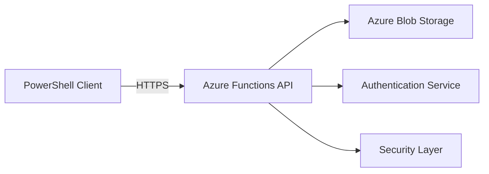

# 🚀 InvokeHub - Enterprise PowerShell Script Management Platform

[](https://azure.microsoft.com/services/functions/)
[](https://dotnet.microsoft.com/)
[](https://microsoft.com/powershell)
[](https://opensource.org/licenses/MIT)
[](http://makeapullrequest.com)

> A secure, cloud-based PowerShell script repository with an interactive cross-platform client. Store, organize, and execute your PowerShell scripts from anywhere with enterprise-grade security.

## ✨ Key Features

- 📁 **Hierarchical Script Organization** - Organize scripts in nested folders
- 🔒 **Enterprise Security** - Path validation, script scanning, rate limiting
- 🌐 **Cross-Platform Client** - Works on Windows, macOS, and Linux
- ⚡ **One-Line Usage** - `irm https://your-api/loader | iex`
- 🔍 **Advanced Search** - Find scripts quickly with metadata support

## 🚀 Quick Start

### For Users

```powershell
# Start InvokeHub with one command
irm https://your-invokehub.azurewebsites.net/api/loader | iex

# Or with API key
irm "https://your-invokehub.azurewebsites.net/api/loader?key=YOUR-KEY" | iex
```

### For Developers

```bash
# Clone and setup
git clone https://github.com/yourusername/invokehub.git
cd invokehub
./scripts/setup-dev.ps1

# Start locally
func start

# Test
irm http://localhost:7071/api/loader | iex
```

### One-Click Azure Deployment

[](https://portal.azure.com/#create/Microsoft.Template/uri/https%3A%2F%2Fraw.githubusercontent.com%2Fyourusername%2Finvokehub%2Fmain%2Fazuredeploy.json)

Or use the deployment script:
```powershell
./scripts/deploy.ps1 -ResourceGroup "rg-invokehub" -Location "westeurope"
```

## 📖 Documentation

| Document | Description |
|----------|-------------|
| [Getting Started](docs/getting-started.md) | Start using InvokeHub in 5 minutes |
| [Development Guide](docs/development.md) | Setup development and deploy to Azure |
| [API Reference](docs/api-reference.md) | Complete API documentation |
| [PowerShell Client](docs/client-guide.md) | Client usage and customization |
| [Security](docs/security.md) | Security features and best practices |
| [Configuration](docs/configuration.md) | Configuration options |
| [Troubleshooting](docs/troubleshooting.md) | Common issues and solutions |

## 🏗️ Architecture



[View detailed architecture →](docs/development/architecture.md)

## 🔧 Configuration

| Variable | Description | Default |
|----------|-------------|---------|
| `AzureWebJobsStorage` | Storage connection string | Required |
| `API_KEY` | API key for authentication | Required* |
| `API_PASSWORD` | Alternative password auth | Required* |
| `BlobContainerName` | Script container name | `powershell-scripts` |

*One authentication method required. [Full configuration guide →](docs/deployment/configuration.md)

## 🤝 Contributing

We love contributions! Please see our [Contributing Guide](CONTRIBUTING.md) for details.

```bash
# Quick contribution workflow
git checkout -b feature/amazing-feature
# Make changes
git commit -m "Add amazing feature"
git push origin feature/amazing-feature
# Open PR
```

## 📊 Project Status

- ✅ Core functionality complete
- ✅ Production ready
- 🚧 Multi Download / Multi Execution

## 🙏 Support

- 💬 [Discussions](https://github.com/bdrogja/InvokeHub/discussions)
- 🐛 [Report Issues](https://github.com/bdrogja/InvokeHub/issues)

## 📄 License

This project is licensed under the MIT License - see the [LICENSE](LICENSE) file for details.

---

<div align="center">
Made with ❤️ by Boris Drogja

⭐ Star me on GitHub!
</div>